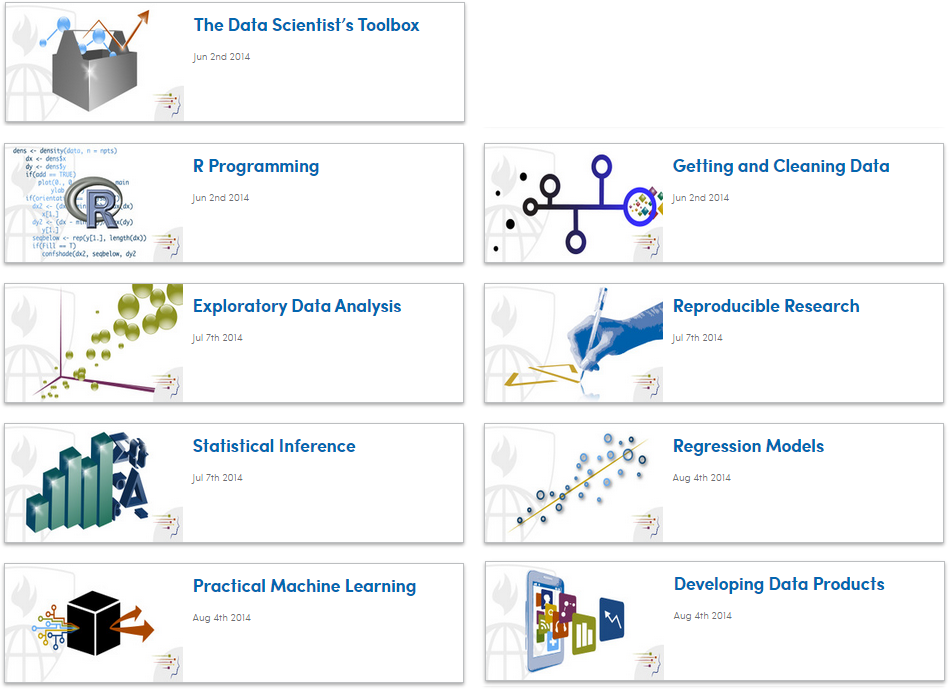
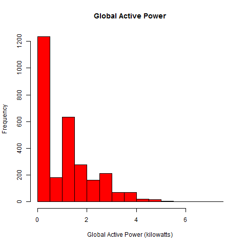
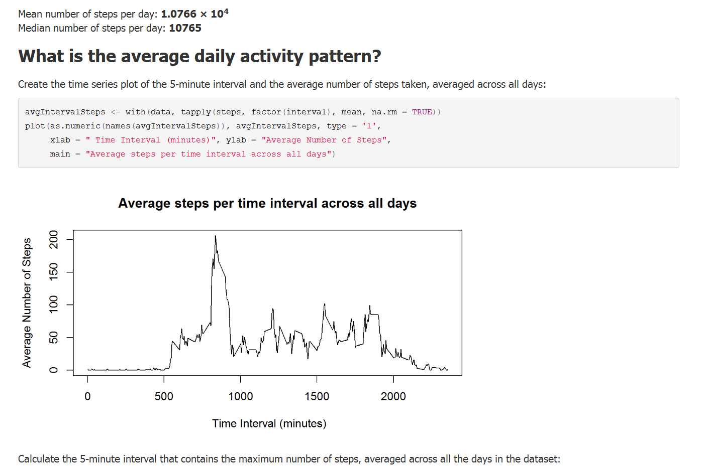
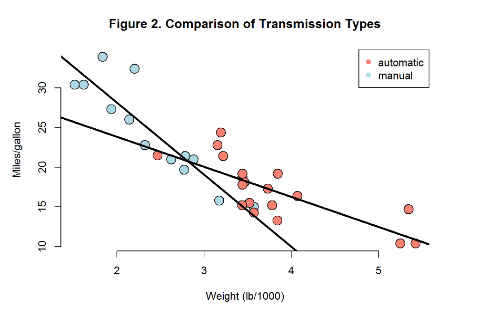

## Data Science Specialization


[https://www.coursera.org/specialization/jhudatascience/1?utm_medium=listingPage](https://www.coursera.org/specialization/jhudatascience/1?utm_medium=listingPage)

---

## Instructors and Material

* Taught by Jeff Leek, PhD, Brian Caffo, PhD, Roger D. Peng, PhD 
* Background is in "data intensive statistics in biology and medicine" 
* All material posted to Github: [https://github.com/DataScienceSpecialization/courses](https://github.com/DataScienceSpecialization/courses)
* Community content posted to Github: [http://datasciencespecialization.github.io/](http://datasciencespecialization.github.io/)

---

## Typical Learning Format
* Lecture videos in 5 - 10 min increments
* Weekly quizes
* 1-2 Peer Reviewed Projects
* 4 weeks long
* User community learning 
    + Coursera Discussion Forums
    + R-bloggers
    + stackoverflow
    + random tutorials

---

## Big Picture of Data Science Skills


[Drew Conway](http://drewconway.com/zia/2013/3/26/the-data-science-venn-diagram)

---

## Data Science Specialization Content



---

## Data Science Specialization Content 

* The Data Scientist's Toolbox
* R Programming
* Getting and Cleaning Data
* Exploratory Data Analysis
* Reproducible Research
* Statistical Inference
* Regression Models
* Practical Machine Learning
* Developing Data Products
* Data Science Capstone

---

## The Data Scientist's Toolbox

* Overview and motivation of Data Science Specialization
* Intro to Git and GitHub
* Intro to R and Rstudio
* Not much more than a set-up guide


---

## R Programming

* Basics of the R language
* Guided R Programming Exercises via swirl (community-generated tutorial)
* Two computer graded programming assignments
    + Write three R functions to generate statistics on data set
    + Write three R functions to rank hospitals based on data set 
* One peer assessed programming assignment 
* Foundation to remaining courses (if not familiar with R)
* Good start, but not enough to feel comfortable in R

---

## Getting and Cleaning Data

* Transforming raw, messy data into tidy data
* What is "tidy data?"
    + One observation per row and one variable per column
* Working with multiple file and data formats
    + CSV, XML, JSON, HDF5
* Reading data from various sources
    + Websites, APIs, mySQL databases
* Manipulating data in R
    + subsetting, sorting, reshaping, merging
* Text formatting with regular expressions
* Considered very useful, would love more of these techniques

---

## Exploratory Data Analysis

* Principles of Analytic Graphics, see work by [Edward Tufte](http://www.edwardtufte.com/tufte/)
* Visualizations through basic R plotting packages 
* Clustering, dimension reduction, handling missing values



```{r, fig.width=4.5, fig.height=4, echo = FALSE}
library(ggplot2)
qplot(displ, hwy, data = mpg, color = drv, main = "mtcars data set")
```


```{r, eval=FALSE}
qplot(displ, hwy, data = mpg, color = drv, main = "mtcars data set")
```

```{r, fig.width=4.5, fig.height=3, echo = FALSE, eval = FALSE}
library(ggplot2)
par(mfrow = c(1, 3))
qplot(displ, hwy, data = mpg, color = drv, main = "mtcars data set")
g <- ggplot(mtcars, aes(drat, wt))
g + geom_point(aes(color = mpg), size = 4, alpha = 1/2)
#qplot(displ, hwy, data = mpg, geom = c("point", "smooth"))
set.seed(1234)
x <- rnorm(12, mean = rep(1:3, each = 4), sd = 0.2)
y <- rnorm(12, mean = rep(c(1, 2, 1), each = 4), sd = 0.2)
dataFrame <- data.frame(x, y)
kmeansObj <- kmeans(dataFrame, centers = 3)
plot(x, y, col = kmeansObj$cluster, pch = 19, cex = 2)
points(kmeansObj$centers, col = 1:3, pch = 3, cex = 3, lwd = 3)
```

---

## Reproducible Research

* Principles and motivation for creating reproducible research
* From code to "published" papers
    + R Markdown -> knitr -> RPubs


---

## Reproducible Research



---

## Statistical Inference

* More significant math compared to other courses
    + Probability
    + Conditional Probability, Bayes' Rule
    + Hypothesis Testing
    + Confidence Intervals
    + Error Rates
* Course material appears to change more than other courses
    + previously only quizes
* "weed-out course"

---

## Regression Models

* Continuation of Statistical Inference
    + Linear Regression, Residuals, Prediction Intervals, Multivariate Regression, 
    + Model Comparison, Generalized Regression Models
* Course project: statistical analysis paper on simple dataset    




---

## Practical Machine Learning

* Quick overview of machine learning
* Easy to use tools (R packages) for machine learning
* Could lead someone to "danger zone"


---

## Developing Data Products

* Overly verbose lectures, fun project
* Several Examples on Twitter: #myDataProduct


---

## Data Science Capstone

* October 27 - December 15


[simplystatistics.org](http://simplystatistics.org/2014/08/19/swiftkey-and-johns-hopkins-partner-for-data-science-specialization-capstone/)

---

## Overall Advantages

* Learn R and extendible features
* Teaching how to teach yourself
* Introduction to wider community of resources
* Growing content from community

---

## Disadvantages/Challenges

* Plagiarism exists for graded projects
* Programming assignments graded by inspection
* Rapidly changing open-source content not always stable
* Free and Open Source Software unapproved at work
* Course website unavailable after each session

---

## Complementary Courses via Coursera

### Machine Learning

* Cousera/Stanford University/Andrew Ng  
* Octave/MATLAB programming
* Detailed Machine Learning Techniques  
* Highly regarded course which launched Coursera
* Next Session: September 22

### Introduction to Data Science

* Coursera/University of Washington/ Bill Howe  
* Python, R, SQL, MapReduce, NoSQL
* Big Data, Relational Algebra 

---

## Udacity's Data Science Curriculum

* More industry focused than academic and somewhat more polished look and feel
* Started "Data Science" series after Coursera, but includes more topics related to "Big Data"
    + Intro to Data Science
    + Intro to Hadoop and MapReduce
    + Data Analysis with R
    + Introduction to Descriptive Statistics
    + Intro Inferential Statistics
    + Machine Learning: Supervised Learning
    + Machine Learning: Reinforcement Learning
    + Machine Learning: Unsupervised Learning
    + Data Wrangling with MongoDB
    + Intro to Statistics
* Nanodegrees: Coming Soon @ [Udacity.com](https://www.udacity.com/nanodegrees)

---

## Additional Courses

[Harvard Data Science Course](http://cs109.github.io/2014/)

---

## Adjacent Resources and Reading

* R-bloggers: [http://www.r-bloggers.com/](http://www.r-bloggers.com/)  
* Rpubs: [https://rpubs.com/](https://rpubs.com/)   
* Useful R packages by Ramnath: [https://github.com/ramnathv](https://github.com/ramnathv)   
* Practice/Competitions: [Kaggle](https://www.kaggle.com/), "The Home of Data Science"   
* Visualizations: 
    + http://d3js.org/
    + leaflet
    
---

## Sources/Credits

---


