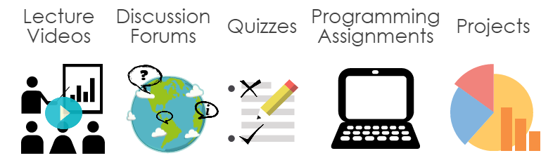
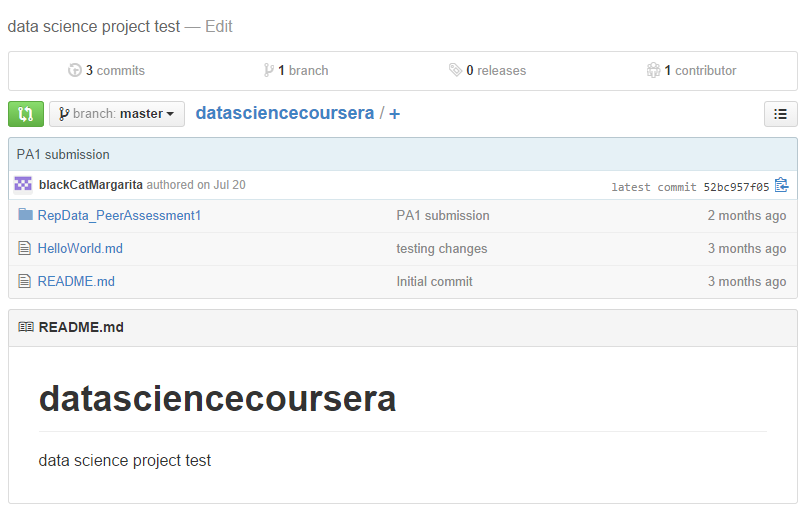
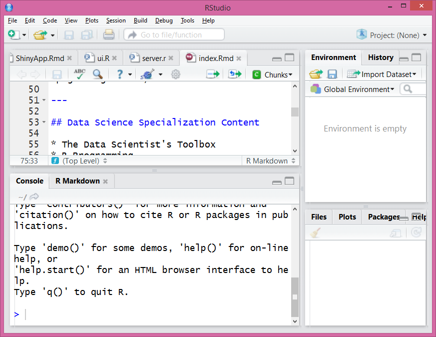
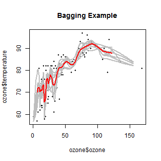

<style> 
.title-slide {background-color: #E0F8F7; /* #EDE0CF; ; #CA9F9D*/}

.title-slide hgroup > h1{font-family: 'Oswald', 'Helvetica', sanserif;}

.title-slide hgroup > h1, 
.title-slide hgroup > h2 {color: #0B6138;  /* ; #EF5150*/} </style>

## Brief History of MOOCs
### (Massive Open Online Courses)

2008: [https://www.khanacademy.org/](https://www.khanacademy.org/)  
Sept 2011:
[https://www.udacity.com/](https://www.udacity.com/)   
April 2012: [https://www.coursera.org/](https://www.coursera.org/)  
May 2012: [https://www.edx.org/](https://www.edx.org/)  

---

## Data Science Specialization


[https://www.coursera.org/specialization/jhudatascience/1?utm_medium=listingPage](https://www.coursera.org/specialization/jhudatascience/1?utm_medium=listingPage)

---

## List of Courses


---

## Instructors and Course Material

* Taught by Jeff Leek, PhD, Brian Caffo, PhD, Roger D. Peng, PhD 
    + Background in "data intensive statistics in biology and medicine" 
* All material posted to Github: [https://github.com/DataScienceSpecialization/courses](https://github.com/DataScienceSpecialization/courses)
* Extra community content posted to Github: [http://datasciencespecialization.github.io/](http://datasciencespecialization.github.io/)
    


---

## Big Picture of Data Science Skills


[Drew Conway](http://drewconway.com/zia/2013/3/26/the-data-science-venn-diagram)

---

## The Data Scientist's Toolbox

* Overview and motivation of Data Science Specialization
* Intro to Git and GitHub
* Intro to R and Rstudio
* Not much more than a set-up guide




---

## R Programming

* Basics of the R language and foundation to remaining courses (if not familiar with R)
* Guided R Programming Exercises via tutorial
* Several programming assignments  
* Good start, but not enough to feel comfortable in R


```r
rankall <- function(outcome, num = "best") {
    ## Read outcome data
    outcomeData <- read.csv("outcome-of-care-measures.csv", colClasses = "character")
    outcomeList <- c("heart attack", "heart failure", "pneumonia")
    testOutcome <- grep(outcome, outcomeList)
    if (length(testOutcome) == 0){
        stop('invalid outcome')
    } # continues...
```

---

## Getting and Cleaning Data

* Transforming raw, messy data into tidy data
* What is "tidy data?"
    + One observation per row and one variable per column
* Working with multiple file and data formats
    + CSV, XML, JSON, HDF5
* Reading data from various sources
    + Websites, APIs, mySQL databases
* Manipulating data in R
    + subsetting, sorting, reshaping, merging
* Text formatting with regular expressions
* Included some of the most practical techniques

---

## Exploratory Data Analysis

* Principles of Analytic Graphics, see work by [Edward Tufte](http://www.edwardtufte.com/tufte/)
* Visualizations through basic R plotting packages 
* Clustering, dimension reduction, handling missing values


 


```r
qplot(displ, hwy, data = mpg, color = drv, main = "mtcars data set")
```


---

## Reproducible Research

* Principles and motivation for creating reproducible research
* From code to "published" papers: R Markdown -> knitr -> RPubs


---

## Reproducible Research


---

## Statistical Inference

* More significant math compared to other courses
    + Probability
    + Conditional Probability, Bayes' Rule
    + Hypothesis Testing
    + Confidence Intervals
    + Error Rates
* Course material appears to change more than other courses
    + previously only quizzes


---

## Regression Models

* Continuation of Statistical Inference
    + Linear Regression, Residuals, Prediction Intervals, Multivariate Regression 
    + Model Comparison, Generalized Regression Models
* Course project: statistical analysis paper on simple dataset    


---

## Practical Machine Learning

* Quick overview of machine learning techniques
    + types of error, cross validation, study design (train/test)
* Easy to use tools (R caret package) for machine learning
    + preprocessing(PCA/SVD), decision trees, bagging, random forests, boosting,...
* Could lead someone to "danger zone" -> [http://www.newscientist.com/blogs/](http://www.newscientist.com/blogs/onepercent/2011/05/google-correlate-passes-our-we.html)


 


[http://www.google.com/trends/correlate](http://www.google.com/trends/correlate)

[http://www.newscientist.com/](http://www.newscientist.com/blogs/onepercent/2011/05/google-correlate-passes-our-we.html)

---

## Developing Data Products

* Verbose lectures, but great examples and fun project
* Several examples on Twitter: [#myDataProduct](https://twitter.com/search?src=typd&q=myDataProduct)

<iframe src="assets/fig/r1.html" width=100%, height=600></iframe>

---

## Leaflet Example

<iframe src="assets/fig/map3.html" width=100%, height=600></iframe>

---

## World Population Example (in millions)

<iframe src="assets/fig/map.html" width=100%, height=700></iframe>

---

## Data Science Capstone

* October 27 - December 15


[simplystatistics.org](http://simplystatistics.org/2014/08/19/swiftkey-and-johns-hopkins-partner-for-data-science-specialization-capstone/)

---

## Overall Advantages

* Learn R with extensible features
* Taught process of continued learning
* Introduction to wider community of resources
* Growing content from community
* Life-cycle approach to creating meaningful data products
    + statistical analysis
    + prediction models
    + visualizations

---

## Disadvantages/Challenges

* Plagiarism exists for graded projects
* Programming assignments graded by inspection
* Rapidly changing open-source content not always stable
* Free and Open Source Software unapproved at work
* Course website unavailable after each session

---

## Complementary Courses via Coursera

### Introduction to Data Science

* Coursera/University of Washington/ Bill Howe  
* Python, R, SQL, MapReduce, NoSQL
* Big Data, Relational Algebra 

### Machine Learning

* Cousera/Stanford University/Andrew Ng  
* Octave/MATLAB programming
* Detailed Machine Learning Techniques  
* Highly regarded course which launched Coursera
* Next Session: September 22

---

## Udacity's Data Science Curriculum

* More industry focused than academic and somewhat more polished look and feel
* Started "Data Science" series after Coursera, but includes more topics related to "Big Data"
    + Intro to Data Science
    + Intro to Hadoop and MapReduce
    + Data Analysis with R
    + Introduction to Descriptive Statistics
    + Intro Inferential Statistics
    + Machine Learning: Supervised Learning
    + Machine Learning: Reinforcement Learning
    + Machine Learning: Unsupervised Learning
    + Data Wrangling with MongoDB
    + Intro to Statistics
* Nanodegrees: To be offered soon by [Udacity.com](https://www.udacity.com/nanodegrees)

---

## Adjacent Resources and Reading

* Simply Statistics: [http://simplystatistics.org/](http://simplystatistics.org/)
* R-bloggers: [http://www.r-bloggers.com/](http://www.r-bloggers.com/)  
* Rpubs: [https://rpubs.com/](https://rpubs.com/)   
* Useful R packages by Ramnath: [https://github.com/ramnathv](https://github.com/ramnathv)   
* "The Home of Data Science": [Kaggle](https://www.kaggle.com/)    
* JavaScript Visualizations in rCharts: 
    + [http://d3js.org/](http://d3js.org/)
    + [http://leafletjs.com/](http://leafletjs.com/)
    + [http://datamaps.github.io/](http://datamaps.github.io/) 
* [Harvard Data Science Course](http://cs109.github.io/2014/)

---


